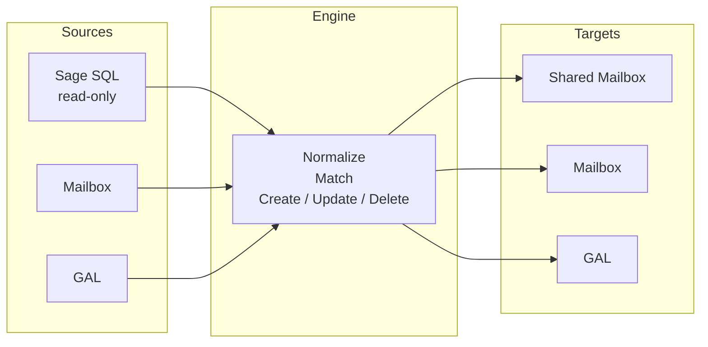
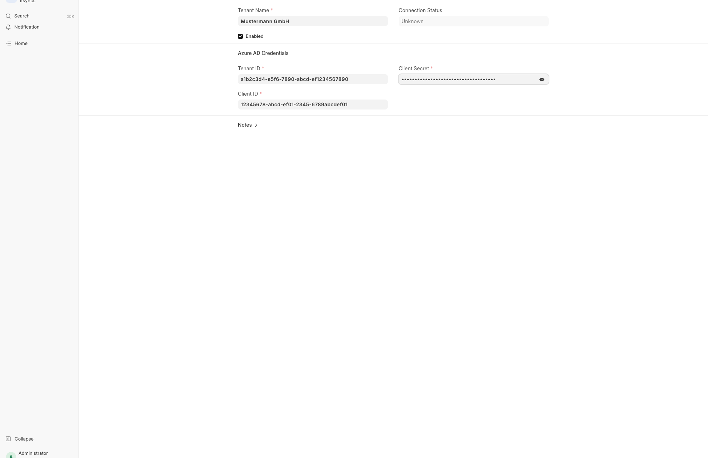
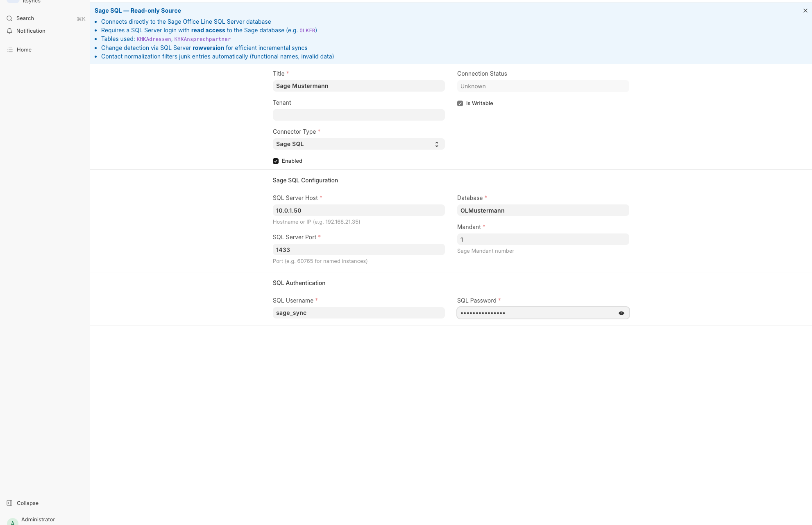
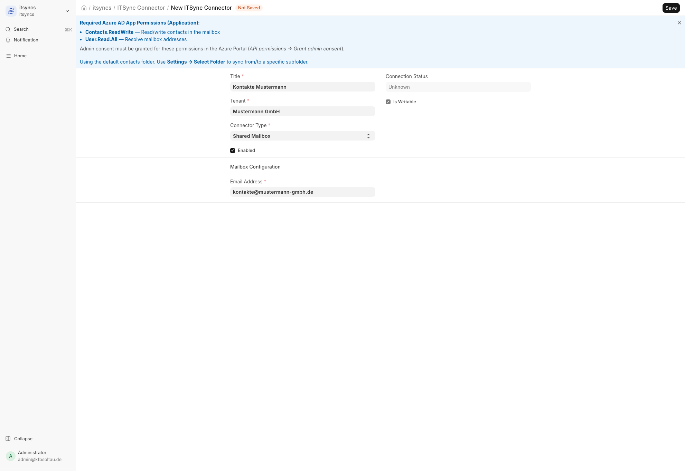
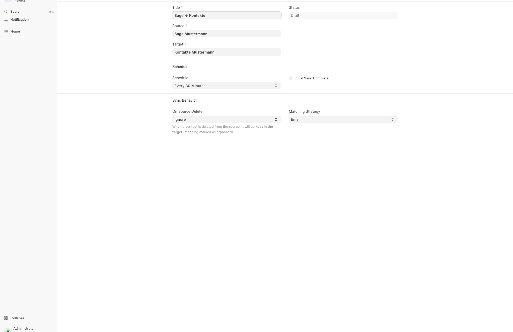
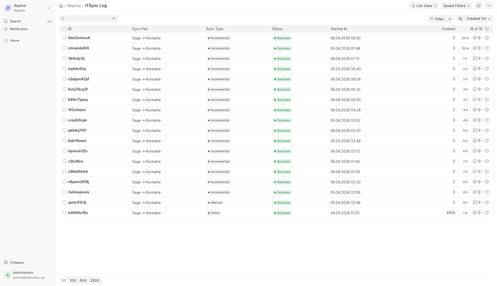

# ITSync

Frappe app for synchronizing contacts between different sources — Sage Office Line, Exchange Online Mailboxes, Shared Mailboxes, and the Global Address List (GAL).

## Features

- **Multi-Source** — Sage SQL (read-only), Exchange Mailboxes, Shared Mailboxes, GAL
- **Incremental Sync** — Change detection via SQL Server rowversion / Graph delta queries
- **Normalization** — Automatic phone (E.164), email, and name cleanup for Sage data
- **Scheduled Sync** — Configurable intervals with background execution
- **Matching** — Email, Email+Name, or Fuzzy matching to prevent duplicates
- **Backup** — Export contacts as VCF, CSV, or JSON

## Architecture



## Module Structure

```
itsyncs/
├── graph/           # Microsoft Graph API (OAuth, Contacts, Exchange, GAL)
├── sage/            # Sage Office Line (SQL Server, normalization)
├── sync/            # Sync engine, matching, backup
├── itsyncs/doctype/ # Frappe DocTypes (Tenant, Connector, Pair, Mapping, Log, Backup)
└── tasks.py         # Scheduled background sync
```

## Installation

```bash
bench get-app $URL_OF_THIS_REPO --branch version-16
bench install-app itsyncs
```

For Sage SQL connectors, install FreeTDS: `sudo apt install freetds-dev`

Requires Frappe v16, Python 3.14+, Node.js 24+.

## Setup Guide

### 1. Create ITSync Tenant

Azure AD app credentials for Exchange access.

| Field | Description |
|-------|-------------|
| Tenant ID | Directory (tenant) ID from Azure App Registration |
| Client ID | Application (client) ID |
| Client Secret | Generated secret (stored encrypted) |



### 2. Create Source Connector (Sage SQL)

Direct SQL Server connection to the Sage Office Line database.

| Field | Description |
|-------|-------------|
| Connector Type | **Sage SQL** |
| SQL Server Host | IP or hostname |
| SQL Server Port | Port (default 1433) |
| Database | Sage database name |
| Mandant | Sage client number (usually 1) |
| SQL Username / Password | SQL Server login credentials |

> Sage SQL connectors are **read-only** — they can only be used as a sync source.



### 3. Create Target Connector (Exchange)

Shared Mailbox where contacts will be synced to.

| Field | Description |
|-------|-------------|
| Connector Type | **Shared Mailbox** |
| Tenant | Select the tenant from step 1 |
| Email Address | Shared mailbox email address |



### 4. Create Sync Pair

Links source to target and controls sync behavior.

| Field | Description |
|-------|-------------|
| Source | Sage SQL connector from step 2 |
| Target | Exchange connector from step 3 |
| Schedule | Sync interval (e.g. Every 30 Minutes) |
| On Source Delete | Ignore (keep orphaned) or Delete |
| Matching Strategy | Email, Email+Name, or Fuzzy |



### 5. Run Sync

1. **Actions → Generate Preview** — shows how many contacts will be created
2. **Actions → Run Initial Sync** — creates all contacts in the target (runs in background)
3. **Enable Auto Sync** — activates scheduled incremental syncs

### 6. Monitor

All syncs are logged in **ITSync Log** with created/updated/deleted/error counts.



## Azure AD Permissions

| Permission (Application) | Required for |
|---------------------------|-------------|
| `Contacts.ReadWrite` | Mailbox / Shared Mailbox |
| `User.Read.All` | All Exchange connectors |
| `Exchange.ManageAsApp` | GAL write access only |

Admin consent must be granted. GAL write additionally requires the Exchange Administrator directory role.

## Sage Contact Normalization

| Issue | Auto-Fix |
|-------|----------|
| Phone formats (`(05146) 987269`, `040/78961-119`) | → E.164 (`+495146987269`) |
| Email (`(at)`, whitespace, broken TLDs) | → corrected |
| Functional names ("Rechnungen", "INFO", "AVIS") | → filtered |
| Order numbers as surnames | → filtered |
| Missing country / homepage protocol | → `DE` / `https://` |

## License

GPL-3.0
